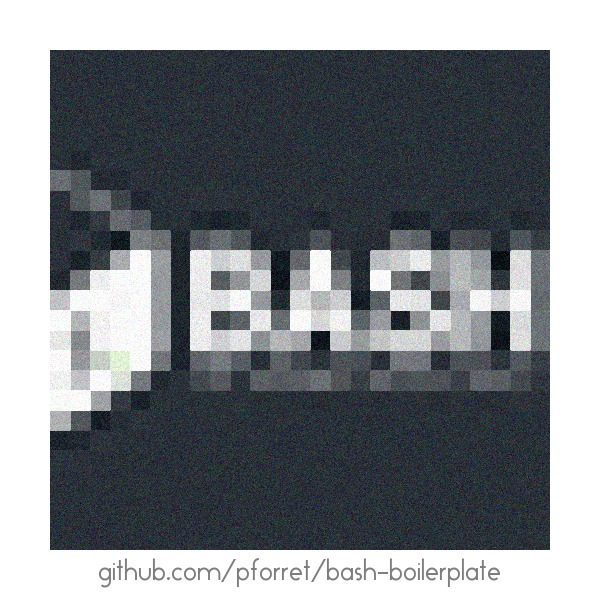

# Github Projects

## bash-boilerplate

* COMPLETE
	* sophisticated option parsing
	* check for all required binaries first
* EASY
	* all code in 1 file - no dependencies
	* distinguish between debug, log, warning and fatal error messages

* repo: [bash-boilerplate](https://github.com/pforret/bash-boilerplate)
* website: [pforret.github.io/bash-boilerplate/](http://pforret.github.io/bash-boilerplate/)

## mrtgobot

* repo: [mrtgobot](https://github.com/pforret/mrtgobot)

## gandi_deploy

* repo: [gandi_deploy](https://github.com/pforret/gandi_deploy)

## mrtg\_remote\_sensor

* repo: [mrtg\_remote\_sensor](https://github.com/pforret/mrtg_remote_sensor)

## winadmin

* [winadmin](https://github.com/pforret/WinAdmin)

# Websites
* [blog.forret.com](https://blog.forret.com)
* [toolstud.io](https://toolstud.io)
* [nuuz.io](https://nuuz.io)
