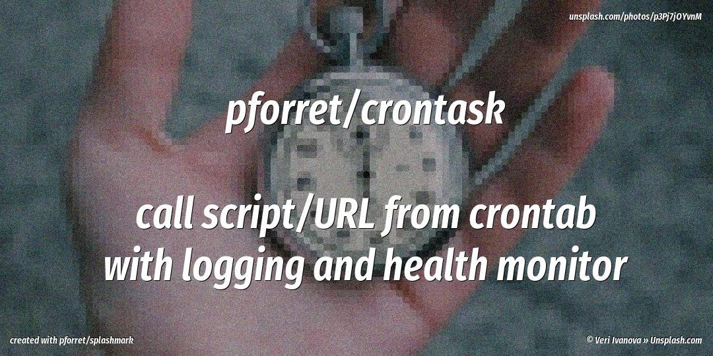

# Github Projects

## [bash-boilerplate](https://github.com/pforret/bash-boilerplate)

Quickly create new bash scripts, with option parsing, verbose mode, external programs check (CLI / bash)

## [gandi_deploy](https://github.com/pforret/gandi_deploy)

Easy fast deploy to Gandi hosting via git workflow (CLI / bash)

## [crontask](https://github.com/pforret/crontask)

run cron jobs with logging, uptime through healthchecks.io, alerts via zapier (CLI / bash)

## [networkcheck](https://github.com/pforret/networkcheck)

analyze network connection problems (CLI / bash)
	
## [mrtgobot](https://github.com/pforret/mrtgobot)

Easy set-up of a MRTG stat chart server, with easy index/run/sftp sync (CLI / PHP)

## [mrtg\_remote\_sensor](https://github.com/pforret/mrtg_remote_sensor)

Get system data like CPU, RAM, folder size in MRTG format from a remote web server (web / PHP)

## [winadmin](https://github.com/pforret/WinAdmin)

Windows Sysadmin scripts for easy folder cleanup, cron and timer:
waCron, waDate, waFTP, waNOCAPS, waRmZip, waTimer  (CLI / Windows cscript)

