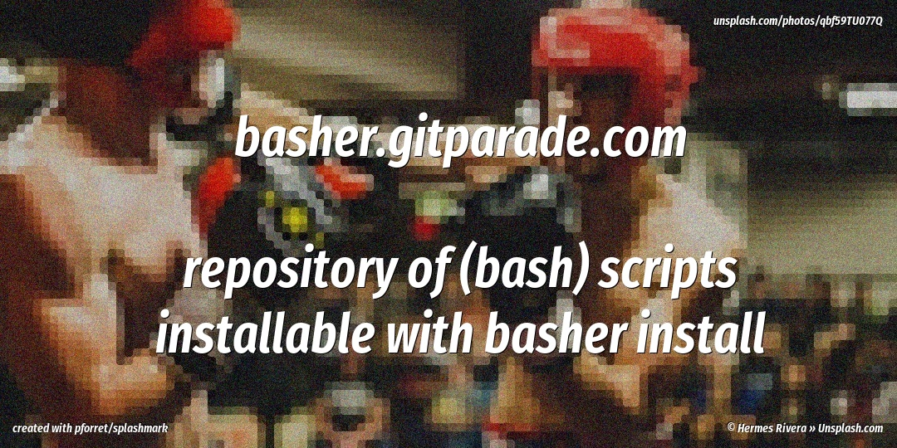
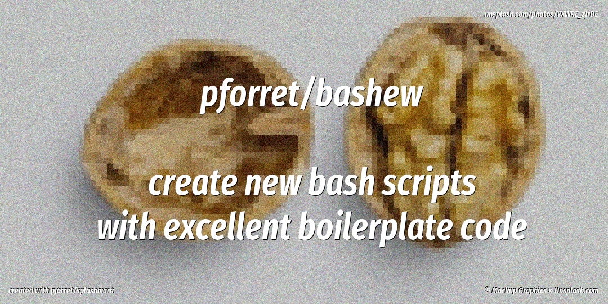
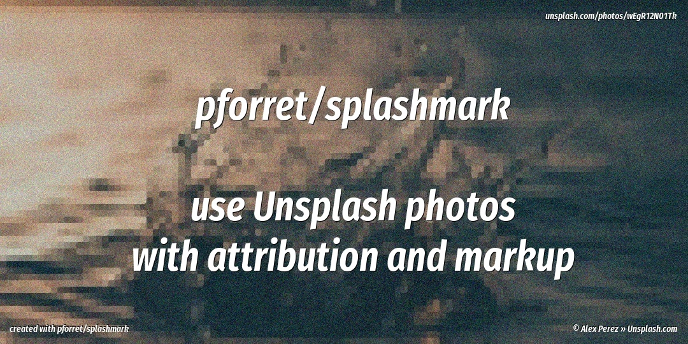
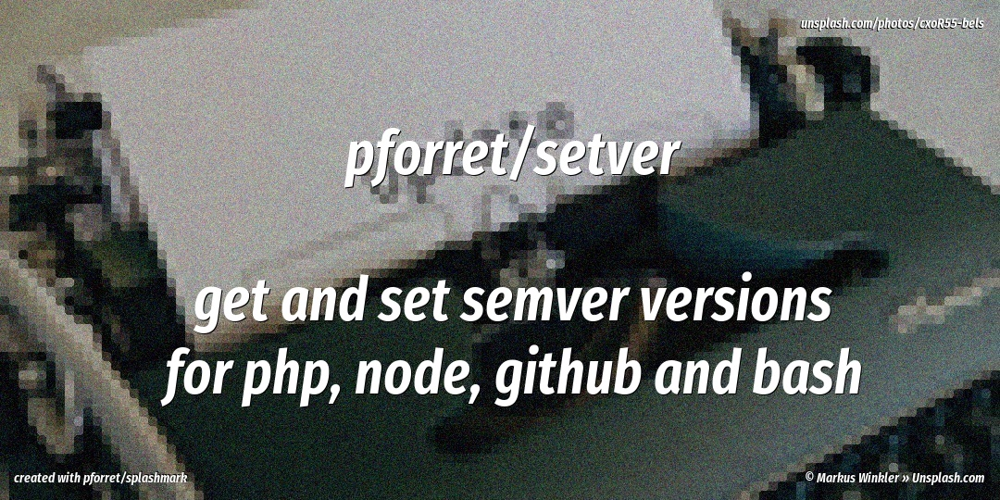
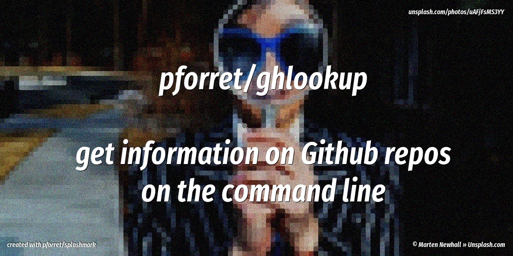
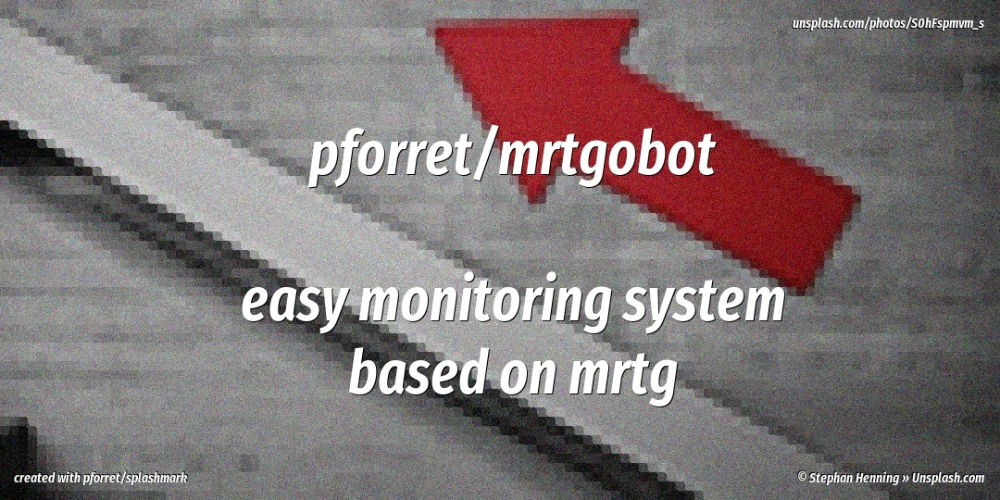

# Github Projects

* Do not remove this line (it will not be displayed)
{:toc}

## [basher.gitparade.com](https://basher.gitparade.com/)

Repository of `basher install` compatible packages

## [pforret/bashew](https://github.com/pforret/bashew)

bash script creator - from small stand-alone script to complex projects with CI/CD and testing

## [pforret/splashmark](https://github.com/pforret/splashmark)

 Download unsplash pics and resize/add effects/add attribution/watermark/... 
 
## [pforret/setver](https://github.com/pforret/setver)

get/set package version from git tags (Github/Bitbucket), composer.json (PHP), package.json (npm)

## [pforret/gandi_deploy](https://github.com/pforret/gandi_deploy)
]

Easy fast deploy to Gandi Simple hosting via git workflow

## [pforret/ghlookup](https://github.com/pforret/ghlookup)
]

Get info on Github repositories via API in bash CLI 

## [pforret/crontask](https://github.com/pforret/crontask)

run cron jobs with logging, uptime through healthchecks.io, alerts via zapier

## [pforret/networkcheck](https://github.com/pforret/networkcheck)

analyze network connection problems
	
## [pforret/mrtgobot](https://github.com/pforret/mrtgobot)

Easy set-up of a MRTG stat chart server, with easy index/run/sftp sync

## [toolstud.io](https://toolstud.io)

## [nuuz.io](https://nuuz.io)
